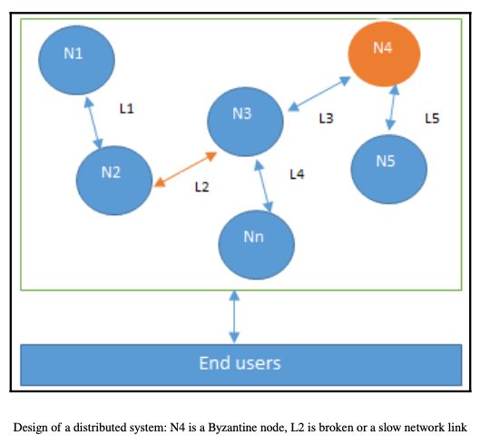

## Welcome to week 1 

___ 
#### 1. Distributed Systems
+ ***Distributed systems:***
    + Distributed systems are a computing paradigm whereby two or more nodes work with each other in a coordinated fashion to achieve a common outcome. It is modeled in such a way that end users see it as a single logical platform. For example, Google's search engine is based on a large distributed system, but to a user, it looks like a single, coherent platform.
    + A ***node*** can be defined as an individual player in a distributed system. All nodes are capable of sending and receiving messages to and from each other. Nodes can be honest, faulty, or malicious, and they have memory and a processor. A node that exhibits irrational behavior is also known as a Byzantine node after the Byzantine Generals Problem.
    + ***Distributed systems*** are so challenging to design that a hypothesis known as the ***CAP theorem*** has been proven, which states that a distributed system cannot have all three of the much-desired properties simultaneously; that is, consistency, availability, and partition tolerance.
| |
|:--:| 
| *Fig 1. A dritributed system with byzantine node* |

#### 2. Bitcoin and Blockchain

+ **Layman's definition**: Blockchain is an ever-growing, secure, shared record keeping system in which each user of the data holds a copy of the records, which can only be updated if all parties involved in a transaction agree to update.
+ **Technical definition**: Blockchain is a peer-to-peer, distributed ledger that is cryptographically-secure, append-only, immutable (extremely hard to change), and updateable only via consensus or agreement among peers.

\- **Definition of Blockchain:** peer to peer transaction in a decentralized network. These below characteristics help Blockchain ensure **Trust** and **Security**: 

+ Immutable Distributed Ledger of records of transactions

+ Validate, Verify and Consensus

\- Some papers and websites for better understanding of fundamental Blockchain concept:

+ [Bitcoin paper - Author: Satoshi Nakamoto](https://bitcoin.org/bitcoin.pdf)

+ [The concept of cryptocurrencies is built from forgotten ideas in research literature - Author: Arvind Narayanan and Jeremy Clark](https://queue.acm.org/detail.cfm?id=3136559)

#### 2. Blockchain structure

\- Many **transactions** form a **block**, many **blocks** form a **chain**, **blocks** go through the **consensus mechanism** to select the **next block** that will be added to the chain. 

+ **A Genesis Block** is the name given to the first block a cryptocurrency

| |
|:--:| 
| *Fig 1. The structure of blockchain* |

\- **Validation** and **consensus** process are carried out by **miners**.

\- I have pictured 2 real blocks on [blockchain.info](https://www.blockchain.com/explorer) to see Bitcoin block and transaction structures. 

|  |  |
:-------------------------:|:-------------------------:
| *Fig 2. The components of previous block* | *Fig 3. The components of current block* |

\- [**Unspent Transaction Outputs (UTXO):**](https://river.com/learn/terms/u/unspent-transaction-output-utxo/) a list of *unspent* Bitcoin amounts that have been sent to a user.

#### 3. Basic operations

\- Main operations: 

+ Validation of transactions

+ Gathering transactions for a block

+ Broadcasting valid transactions & blocks 

+ Using consensus mechanism for adding next block 

+ Chaining the block

\- Participants : 

+ Users: initiating transactions 

+ Miners: 

    - Verify transactions

    - Broadcast transactions

    - Compete to create a block 

    - Reach consensus by validating block to add the block

    - Broadcast new block

    - Confirm transactions 

    - Finally, miners will get incentives 

|  |
:---:
|*Fig 4. How bitcoin transactions work*|

\- Actually, after writing a bunch of theory, I am quite vague about how operations work. Then, I have had read this article [how-bitcoin-transactions-work](https://www.bitcoin.com/get-started/how-bitcoin-transactions-work/) and found it concise to gain more understanding above concepts and procedures. So, I highly recommend you read it. 

#### 4. Beyond bitcoin

\- Three types of Blockchain: 

+ Only cryptocurrency: For example, Bitcoin,...

+ Currency and business logic: For example, Ethereum,..

+ Only business logic: For example, Hyperledger

\- Blockchain categories: 

+ ***Public blockchain:*** 

    + Open, decentralized networks of computers

    + Use PoW and PoS consensus mechanisms 

    + For example: Bitcoin, Ethereum,...

+ ***Private blockchain:***

    + Have access restrictions (governed by an organization, a company,...) and be centralized

    + For example: Private Ethereum,...
    
+ ***Consortium blockchains:***

    + A consortium is a special type of blockchain where multiple individuals or organizations govern the blockchain network.
    
    + For example: Hyperledge Fabric,...
    
+ ***Hybrid blockchain:***

    + Combination of public and private blockchain

+ ***Sidechains:***

    + Running parallel to the main chain.
    + More precisely known as ***pegged sidechains***, this is a concept whereby coins can be moved from one blockchain to another and moved back again. Typical uses include the creation of new altcoins (alternative cryptocurrencies) whereby coins are burnt as a ***proof of an adequate stake***. Burnt or burning the coins in this context means that the coins are sent to an address which is unspendable and this process makes the burnt coins irrecoverable. This mechanism is used to bootstrap a new currency or introduce scarcity which results in increased value of the coin.
    + This mechanism is also called ***Proof of Burn (PoB)*** and is used as an alternative method for distributed consensus to ***PoW*** and ***Proof of Stake (PoS)***. The aforementioned example for burning coins applies to a one-way pegged sidechain. The second type is called a two-way pegged sidechain, which allows the movement of coins from the main chain to the sidechain and back to the main chain when required.
    + This process enables the building of smart contracts for the Bitcoin network. Rootstock is one of the leading examples of a sidechain, which enables smart contract development for Bitcoin using this paradigm. It works by allowing a two-way peg for the Bitcoin blockchain, and this results in much faster throughput.

 
#### 5. Consensus Mechanisms
+ ***Consensus*** is the backbone of a blockchain and, as a result, it provides decentralization of control through an optional process known as mining. The choice of the consensus algorithm is also governed by the type of blockchain in use; that is, not all consensus mechanisms are suitable for all types of blockchains. For example, in public permissionless blockchains, it would make sense to use PoW instead of a simple agreement mechanism that is perhaps based on proof of authority. Therefore, it is essential to choose an appropriate consensus algorithm for a particular blockchain project.
+ A ***consensus mechanism*** is a set of steps that are taken by most or all nodes in a blockchain to agree on a proposed state or value.
There are various requirements that must be met to provide the desired results in a consensus mechanism. The following describes these requirements:
+ ***Agreement***: All honest nodes decide on the same value
+ ***Termination***: All honest nodes terminate execution of the consensus process and
eventually reach a decision
+ ***Validity***: The value agreed upon by all honest nodes must be the same as the initial value proposed by at least one honest node
+ ***Fault tolerant***: The consensus algorithm should be able to run in the presence of faulty or malicious nodes (Byzantine nodes)
+ ***Integrity***: This is a requirement that no node can make the decision more than once in a single consensus cycle

***Types of consensus mechanisms***
+ ***Traditional Byzantine Fault Tolerance (BFT)-based:*** With no compute-intensive operations, such as partial hash inversion (as in Bitcoin PoW), this method relies on a simple scheme of nodes that are publisher-signed messages. Eventually, when a certain number of messages are received, then an agreement is reached.
+ ***Leader election-based consensus mechanisms:*** This arrangement requires nodes to compete in a leader-election lottery, and the node that wins proposes a final value. For example, the PoW used in Bitcoin falls into this category.

 
***Proof of Work (PoW)*** and ***Proof of Stake (PoS)*** are two widely used consensus mechanisms in blockchain technology. Each has a unique approach to validating transactions and securing the network.

####  ***1. Proof of Work (PoW)***
Proof of Work requires network participants, called "miners," to solve complex mathematical puzzles to validate transactions and add them to the blockchain. The process of solving these puzzles involves trial and error, consuming significant computational power and energy.

Example: Bitcoin

Miners compete to solve a cryptographic puzzle. For Bitcoin, this puzzle involves finding a hash (an encrypted output) that meets specific criteria, like having a certain number of leading zeros.
When a miner finds the correct hash, they broadcast it to the network, and if validated, they add the block of transactions to the blockchain.
The miner is rewarded with Bitcoin (block reward) and transaction fees from that block.
Because PoW consumes considerable computational resources, it’s often criticized for its environmental impact.
Pros and Cons:

Pros: High security due to the computational difficulty of attacks.
Cons: Energy-intensive and slow transaction processing.

####   ***2. Proof of Stake (PoS)***
Proof of Stake uses a different approach. Here, validators (instead of miners) are chosen to create or validate new blocks based on the amount of cryptocurrency they hold and are willing to "stake" or lock up as collateral. This makes it less energy-intensive, as it doesn’t require intensive computations.

Example: Ethereum 2.0

In Ethereum 2.0, participants must hold (stake) a minimum amount of ETH to become validators.
Validators are chosen randomly based on their staked amount, with larger stakes increasing their chances of being chosen.
If a validator acts dishonestly, part or all of their staked ETH can be slashed as a penalty.
Validators receive rewards in the form of transaction fees and potentially additional ETH, making PoS less resource-intensive.
Pros and Cons:

Pros: Energy-efficient and faster than PoW.
Cons: May favor wealthier participants, as those with more tokens have more influence over block validation.
Summary of Differences
Feature	Proof of Work (PoW)	Proof of Stake (PoS)
Energy consumption	High	Low
Security	High but energy-intensive	High, with penalties for misconduct
Block validation time	Longer (depends on computation)	Shorter (depends on network design)
Reward distribution	Block rewards and transaction fees	Transaction fees and staking rewards

